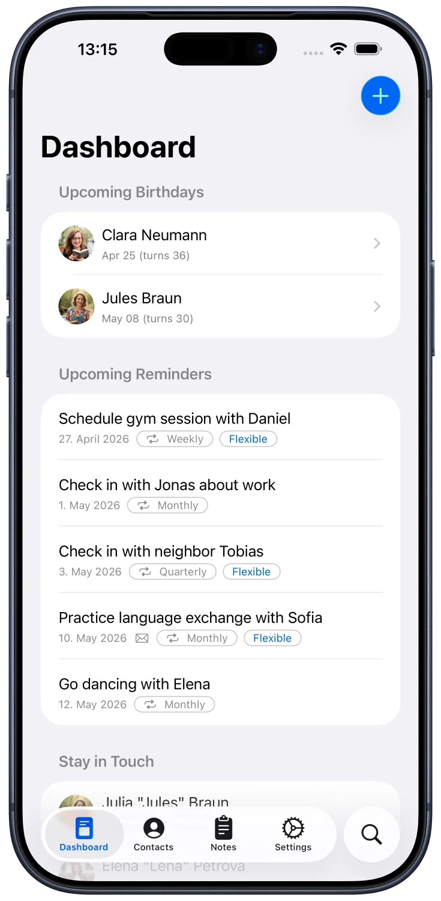
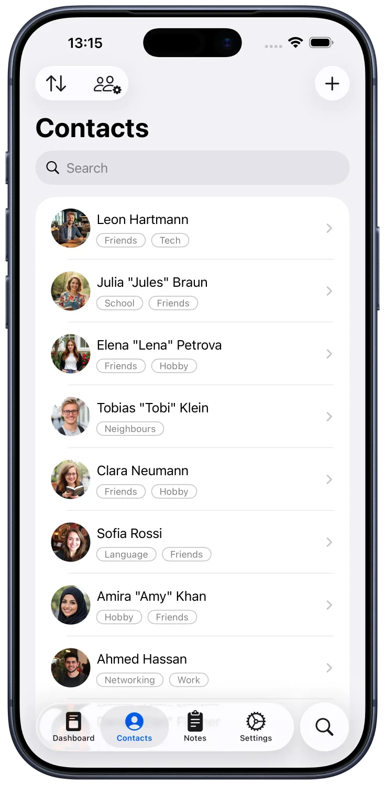
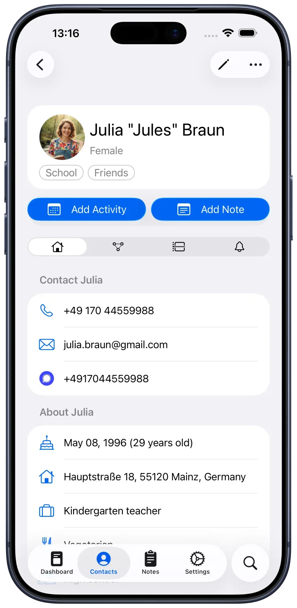

# Meerkat-iOS (pending change)

Native iOS client app for [Meerkat CRM](https://github.com/fbuchner/meerkat-crm)

> [!WARNING]  
> This app is in early beta and still missing basic functionality.

You can download the TestFlight beta here https://testflight.apple.com/join/brYGATwp

## Roadmap

- [ ] Support all functionality of the Meerkat WebUI
- [ ] Synchronize reminders with iOS (optionally)

## Expansion Ideas

- [ ] Add widgets
- [ ] Implement AppIntents for integration with Shortcuts and Siri

## Screenshots

    
    
    

